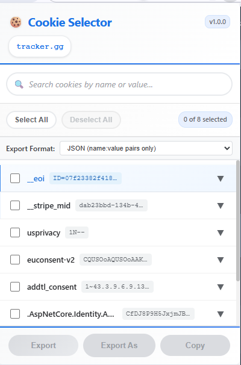

# Cookie Selector - Chrome Extension for Cookie Management


> **Smart cookie management for web developers** - A professional Chrome extension to view, select, and export website cookies with advanced filtering and multiple format support.

## 🚀 Features

### ✨ **Advanced Cookie Management**

- **Real-time cookie viewing** for any website domain
- **Smart search functionality** with instant filtering
- **Bulk selection controls** (Select All/Deselect All)
- **Cookie expansion** for detailed information viewing
- **Domain-specific filtering** with parent domain support

### 📤 **Multiple Export Formats**

- **JSON (Simple)** - Name-value pairs only for quick integration
- **JSON (Complete)** - Full cookie data with all attributes
- **Netscape Format** - Browser-compatible cookie file format
- **Direct download** or **clipboard copy** functionality

### 🎯 **Developer-Focused Features**

- **Permission management** with clear error handling
- **Keyboard navigation** support for accessibility
- **Responsive design** optimized for developer workflows
- **Performance optimized** with virtual scrolling for large cookie sets
- **Browser compatibility** across Chrome, Edge, and Chromium browsers

## 📸 Screenshots

### Main Interface



**Key Features Shown:**

- 🍪 **Cookie Selector** header with version badge
- 🔍 **Smart search functionality** for filtering cookies by name or value
- 📊 **Bulk selection controls** (Select All/Deselect All with count display)
- 📤 **Export format selection** (JSON, JSON All, Netscape formats)
- 📋 **Cookie list** with expandable details and professional styling
- 🎯 **Clean, developer-focused interface** optimized for productivity

_Professional cookie management interface designed for web developers_

## 🛠️ Installation

### From Chrome Web Store (Recommended)

1. Visit the [Chrome Web Store](https://chrome.google.com/webstore)
2. Search for "Cookie Selector"
3. Click "Add to Chrome"
4. Grant necessary permissions

### Manual Installation (Developer Mode)

1. Download or clone this repository
2. Open Chrome and navigate to `chrome://extensions/`
3. Enable "Developer mode" in the top right
4. Click "Load unpacked" and select the extension folder
5. The Cookie Selector extension will appear in your toolbar

## 📖 Usage Guide

### Basic Cookie Management

1. **Navigate** to any website
2. **Click** the Cookie Selector extension icon
3. **View** all cookies for the current domain
4. **Search** cookies by name or value using the search box
5. **Select** individual cookies or use bulk selection

### Advanced Export Options

1. **Choose export format** from the dropdown:
   - JSON (name:value pairs)
   - JSON All (complete data)
   - Netscape (browser format)
2. **Select cookies** you want to export
3. **Export** directly or **Export As** to choose location
4. **Copy** to clipboard for immediate use

## 🔧 Technical Specifications

### Browser Compatibility

- **Chrome** 88+ (Manifest V3)
- **Microsoft Edge** 88+
- **Chromium-based browsers**

### Permissions Required

```json
{
  "permissions": ["cookies", "activeTab", "downloads"],
  "host_permissions": ["<all_urls>"]
}
```

### Technology Stack

- **Manifest V3** - Latest Chrome extension standard
- **Vanilla JavaScript** - No external dependencies
- **Modern CSS** - Responsive design with animations
- **Chrome APIs** - Cookies, Downloads, Tabs

## 🎨 Architecture

### File Structure

```
cookie-manager/
├── manifest.json          # Extension configuration
├── popup.html             # Main interface HTML
├── popup.css              # Styling and animations
├── popup.js               # Core functionality
├── background.js          # Service worker
└── icons/                 # Extension icons
    ├── icon16.png
    ├── icon32.png
    ├── icon48.png
    └── icon128.png
```

### Key Components

- **Cookie API Integration** - Real-time cookie access
- **Domain Extraction** - Smart domain parsing and validation
- **Export Engine** - Multiple format support with file handling
- **UI Components** - Responsive interface with accessibility

## 🔒 Privacy & Security

### Data Handling

- **No data collection** - All operations are local
- **No external requests** - Cookies stay on your device
- **Secure permissions** - Only accesses cookies when needed
- **Transparent operations** - Open source for full visibility

### Security Features

- **Restricted page handling** - Cannot access internal browser pages
- **Permission validation** - Checks API availability before use
- **Error boundaries** - Graceful handling of edge cases
- **Input sanitization** - Safe handling of cookie data

## 🧪 Development

### Prerequisites

- **Node.js** (for development tools)
- **Chrome Browser** (for testing)
- **Basic knowledge** of JavaScript and Chrome APIs

### Setup Development Environment

```bash
# Clone the repository
git clone https://github.com/SSujitX/cookie-selector.git

# Navigate to directory
cd cookie-selector

# Load in Chrome (Developer Mode)
# Go to chrome://extensions/ and click "Load unpacked"
```

### Building and Testing

```bash
# Test in Chrome
# Load the extension in developer mode
# Test on various websites

# Check console for errors
# Validate permissions and functionality
```

## 🤝 Contributing

We welcome contributions! Please see our [Contributing Guidelines](CONTRIBUTING.md) for details.

### How to Contribute

1. **Fork** the repository
2. **Create** a feature branch (`git checkout -b feature/amazing-feature`)
3. **Commit** your changes (`git commit -m 'Add amazing feature'`)
4. **Push** to the branch (`git push origin feature/amazing-feature`)
5. **Open** a Pull Request

### Development Guidelines

- Follow **ES6+ JavaScript** standards
- Maintain **Manifest V3** compatibility
- Write **clean, documented code**
- Test across **multiple websites**
- Ensure **accessibility compliance**

## 📋 Roadmap

### Version 1.1.0 (Upcoming)

- [ ] **Dark theme** support
- [ ] **Cookie editing** capabilities
- [ ] **Import functionality** for cookie files
- [ ] **Scheduled exports** automation

### Version 1.2.0 (Future)

- [ ] **Multi-domain** cookie management
- [ ] **Cookie analytics** and insights
- [ ] **Team sharing** features
- [ ] **Advanced filtering** options

## 🐛 Bug Reports & Feature Requests

Found a bug or have a feature idea? We'd love to hear from you!

- **Bug Reports**: [Create an Issue](https://github.com/SSujitX/cookie-selector/issues)
- **Feature Requests**: [Start a Discussion](https://github.com/SSujitX/cookie-selector/discussions)
- **Support**: [Check our Wiki](https://github.com/SSujitX/cookie-selector/wiki)

## 📄 License

This project is licensed under the **MIT License** - see the [LICENSE](LICENSE) file for details.

## 🌟 Keywords

**Chrome Extension** | **Cookie Management** | **Web Development Tools** | **JavaScript** | **Manifest V3** | **Developer Tools** | **Browser Extension** | **Cookie Export** | **Web Cookies** | **Privacy Tools** | **Developer Productivity** | **Cookie Viewer** | **Cookie Editor** | **Web Development** | **Browser Tools** | **Cookie Analysis** | **JSON Export** | **Netscape Format** | **Cookie Debugging** | **Web Developer** | **Frontend Development** | **Browser Automation** | **Cookie Inspector** | **Web Security** | **Cookie Selector**

---

<div align="center">

**Made with ❤️ for web developers**

[⭐ Star this repo](https://github.com/SSujitX/cookie-selector) | [🍪 Try the extension](https://chrome.google.com/webstore) | [📖 Read the docs](https://github.com/SSujitX/cookie-selector/wiki)

</div>
